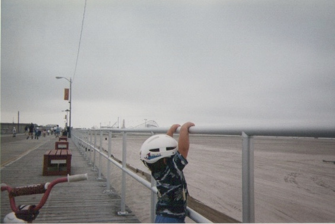

I first learned to ride a bike at 2 years old. While never documented on VHS, I tore past my terrible twos without training wheels. I'd ride fast, go hard and crash often. Which helps to explain why I was able to learn so quickly.

 I'd circle my neighborhood tracked by my mom's footsteps or fretful gaze. Relentlessly peddling and puffing without coasting. Eventually, exhausted, I'd collapse into the grass or if I was lucky, a convenient mulch pile. 
 
 As a kid I was compared to the Tasmanian Devil cartoon, speaking in sputtering growls and being endlessly destructive. Whirling around on my bike surrounded by the dust cloud accumulated with each crashing stop only made this more apt.  

Of course these memories are fueled more by what my family has told me than anything I can directly remember. Besides what is mostly myth, I can clearly recall just 3 other biking memories: 

1. Contently circling the neighborhood on my 9th birthday. Soaking up picturesque autumn weather between a pancake breakfast and the birthday cake and post-season baseball to come later. 
2. Crashing down a hill in middle school while riding with my dad. Tearing into the heel of my palms so deeply, that I still have scars today and not wanting to ride ever again. 
3. Riding to an 8:30 calculus recitation in early September thinking that biking could save me crucial time in the race across campus. I never repeated that ride (yet still managed to go to most of those recitations!) leaving the same bike I crashed years ago to rust out along so many others abandoned, when I went home for the following summer.

I did get back into biking though. And since August of 2019, have rode hundreds of miles more than I ever have (and crashed landed into far less mulch piles) As I continue to bike I see myself focusing on the following aspects of biking:
- [Exercise](http://localhost:8000/biking-biker/)
- [Repair/Hobby Tinkering](http://localhost:8000/biking-builder/)
- [Community Forming]() 

